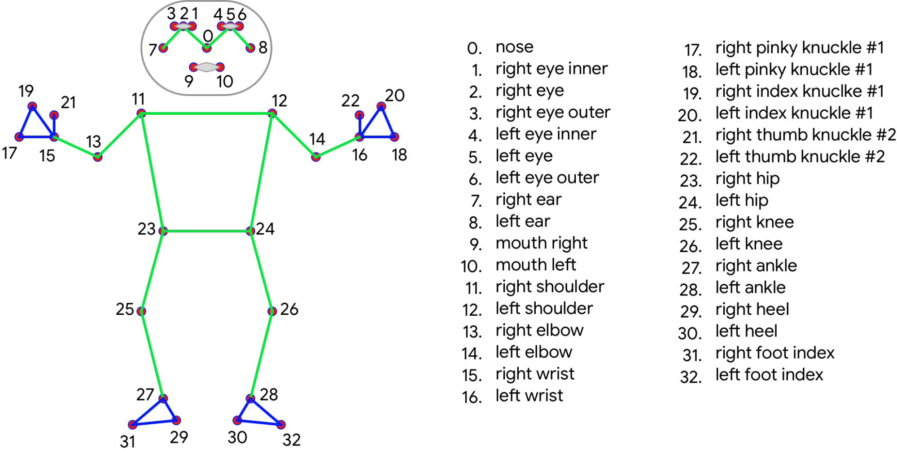

# School of Computing &mdash; Year 4 Project Proposal Form

> Edit (then commit and push) this document to complete your proposal form.
> Make use of figures / diagrams where appropriate.
>
> Do not rename this file.

## SECTION A

|                     |                   |
|---------------------|-------------------|
|Project Title:       | xxxxxx            |
|Student 1 Name:      | Killian Connolly  |
|Student 1 ID:        | 17303116          |
|Student 2 Name:      | William John O Hanlon            |
|Student 2 ID:        | 17477494            |
|Project Supervisor:  | Tom Ward            |

> Ensure that the Supervisor formally agrees to supervise your project; this is only recognised once the
> Supervisor assigns herself/himself via the project Dashboard.
>
> Project proposals without an assigned
> Supervisor will not be accepted for presentation to the Approval Panel.

## SECTION B

> Guidance: This document is expected to be approximately 3 pages in length, but it can exceed this page limit.
> It is also permissible to carry forward content from this proposal to your later documents (e.g. functional
> specification) as appropriate.
>
> Your proposal must include *at least* the following sections.

### Introduction

> Describe the general area covered by the project.

Due to the Covid-19 pandemic, many people had to find alternate means of exercise which didn’t require leaving their homes or grounds. One such means of exercise was Mixed Martial Arts training (MMA), such as shadowboxing and / or bag work. These exercises can be completed safely at home by an individual, or a group of people, and entail cardio heavy workouts.  
Within the art of Mixed Martial Arts there are certain techniques that are important to perform correctly, otherwise injury may occur. Our project aims to provide people with a means to practice MMA at home while ensuring they do not injure themselves in the process, through poor technique or form.  

### Outline

> Outline the proposed project.

Our project idea is to make a mobile app which will use pose estimation and computer vision to provide feedback on a user’s technique, in regards to several different MMA exercises. Users will position themselves in front of their mobile devices, in full view and orientated as directed by the app, and perform the predefined exercise numerous times. The app will then return a comparative of the user’s technique and that of the preferred professional technique. This will be communicated through overlaying the user’s recorded technique with a graphical display of preferred technique, along with a small text note on possible errors in form.  
Moreover, the comparative between the user’s technique and the mean preferred technique will be calculated using a custom heuristic. This method will take the pose estimations of the user’s position in each frame as input.  
Furthermore, we hope to implement a simulation feature into the app. Using the camera of the mobile device, through the app, the user will record themselves performing a predefined sequence of MMA techniques. This sequence will be explained to the user prior to the exercise and / or will be communicated audibly to the user during the course of the exercise. The objective of this exercise is to provide a pseudo-simulation of an opponent, to practice and improve the users overall performance and technique.  
Post exercise, the user will be shown the recorded video with a graphical overlay of a simulated opponent, responding to the predefined techniques. Users will be given feedback on whether the opponent connected with a strike due to error in the user’s technique or reactions. This simulation will be generated by a machine learning model, given the user’s pose positions in the frames as input.  

### Background

> Where did the ideas come from?

As MMA enthusiasts ourselves, we use bag work and shadow boxing as a means of exercise and staying healthy during the continued lockdown. However, since neither of us are experts in MMA training, by any means, our ability and technique is biased to our own interpretation. Having prior experience with machine learning and image processing, and realising that there are possibly many others in a similar situation to ours, we came up with this project idea.  

### Achievements

> What functions will the project provide? Who will the users be?

The functionalities our project provides for the user is as follows:  
- Improve precision of users technique  
- Provide user specific feedback  
- Reduce injuries  
- At home exercises / workouts helping users stay healthy  
- Interactive display using a simulated opponent  

The following groups are who our project is aimed at:  
- MMA enthusiasts and/or beginners  
- MMA Companies such as UFC and Belator  
- Boxing/MMA couches  
- Researchers  

### Justification

> Why/when/where/how will it be useful?

With the ongoing pandemic of Covid-19, we wanted to create an application that caters for MMA enthusiasts to keep active while being at home since gyms and activities groups keep being put on hold.
We also wanted to create something that will perfect techniques in a playful way by creating the simulation opponent. Obtaining the perfect technique is crucial to prevent unnecessary injuries (https://www.mayoclinic.org/healthy-lifestyle/fitness/in-depth/overuse-injury/art-20045875).
Since the application will be on mobile, it will be extremely diverse, being able to operate in the home and even gyms. Coaches and trainers will be able to utilise the applications for their clients.

### Programming language(s)

> List the proposed language(s) to be used.

- Go - will be used to write and compile the models.  
- Java - will be used to develop the mobile application.  
- SQL - will be used to store information server-side and locally.  
- Python3 - will be used for initial data manipulation for the models.  

### Programming tools / Tech stack

> Describe the compiler, database, web server, etc., and any other software tools you plan to use.

- Go Compiler  
- Tensorflow  
- Blazepose  
- MySQL  
- SQLite  
- Android Studio  
- Linux  
- Windows  

### Hardware

> Describe any non-standard hardware components which will be required.

GPUs - Since building machine learning models are computationally intensive, high powered GPUs are required to speed up the process of learning.  
Cameras - Cameras on the mobile device will be utilised as a means of recording the users workout.

### Learning Challenges

> List the main new things (technologies, languages, tools, etc) that you will have to learn.

- Go programming language  
- Pose estimation / Pose detection  
- Blazepose  
- Android Studio / Android App Development  

### Breakdown of work

> Clearly identify who will undertake which parts of the project.
>
> It must be clear from the explanation of this breakdown of work both that each student is responsible for
> separate, clearly-defined tasks, and that those responsibilities substantially cover all of the work required
> for the project.

#### Student 1

> *Student 1 should complete this section.*

- Test pose estimation models  
- Design UI and build mobile application  
- Obtaining native camera device from mobile  
- Integrate pose estimation model into app  
- Use pose estimation data to produce a report (textual and graphical)  
- Testing entire system  

#### Student 2

> *Student 2 should complete this section.*

- Display report information to screen   
- Set up local SQLite database for professional techniques  
- Set up server-side SQL database for login details and simulation processing  
- Implement simulation program / models using professional techniques  
- Collecting and manipulating dataset samples  
- Testing mobile application  
- Testing entire system  

## Blazepose Pose Estimation Points

  

